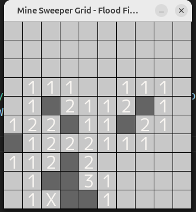

# mine-sweeper

這個 repository 主要用來 demo 使用 golang 來實做踩地雷遊戲的功能

目標會採用 ebiten 來作畫面展現的遊戲引擎

預期會先從核心功能開始寫，最後再加上 ebiten 來作畫面渲染

## 踩地雷遊戲介紹

踩地雷是一款經典益智遊戲，玩家在方格棋盤上翻開格子。部分格子下隱藏著地雷，若踩到地雷則遊戲失敗。安全格子會顯示一個數字，代表「周圍八個格子中有幾顆雷」。玩家需要根據數字推理出地雷位置，並標記旗子避免誤踩。遊戲目標是「找出所有安全格子，並正確標記所有地雷」。

## 🕹️ 遊戲規則（數值化說明）

### 1.盤面大小

* 常見為 9x9、16x16、30x16 三種經典尺寸。
* 每個格子可以是 地雷 或 安全格。
* 📊 例：
  * 初級：9x9 = 81 格，含 10 顆雷
  * 中級：16x16 = 256 格，含 40 顆雷
  * 高級：30x16 = 480 格，含 99 顆雷

### 2. 格子狀態

* 每個格子有三種基本狀態：
  * 未揭開：起始狀態，玩家看不到內部內容。
  * 已揭開：顯示數字（0~8）或地雷（爆炸）。
  * 已標記：玩家插旗，代表懷疑此格有地雷。

### 3. 數字提示

* 當一格被揭開且不是地雷時，會顯示一個數字 N，代表 該格子周圍 8 個格子中有 N 顆地雷。
* N 的範圍是 0 ~ 8。
* 如果 N=0，則會觸發 自動展開，將周圍連鎖的安全格子一起揭開。
* 📊 例：
  * 揭開某格顯示 3 → 表示這格的上下左右斜對角八格中總共有 3 顆雷。

### 4. 遊戲勝負條件

* 失敗條件：揭開的格子是地雷。
* 勝利條件：所有 非地雷的格子 都被揭開。
* 判斷方式：
  * 假設總格子數為 T，地雷數為 M，安全格數為 S = T - M。
  * 當玩家揭開的安全格數量 = S，即可勝利。

## 示意圖

## Flood fill 執行結果

